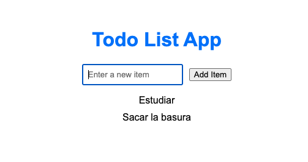

# Introducción a JavaScript y React

### Disclaimer
Esta es una introducción rápida a JavaScript y React más que nada para explicar conceptos claves y funcionalidades de cada tecnología que les serán de ayuda para la actividad del próximo jueves.

**Si quieres aprender más en detalle cada tecnología o hay algún concepto que no te quedo claro, se recomienda fuertemente leer la documentación. Donde hay ejemplos bastante claros y extensos del material de esta ayudantía.**

[Documentación de JavaScript de MDN](https://developer.mozilla.org/en-US/docs/Web/JavaScript)

[Documentación de React](https://react.dev/learn)

# ¿ Qué es JavaScript ?

### Descripción larga 🤯:
Lenguaje de alto nivel, single threaded, garbage collected, interpretado o compilado JIT, basado en prototipo, multiparadigma, dinámico con un loop de eventos no bloqueante.

### Descripción corta 😁:
Lenguaje de programación/scripting usado principalmente para la construcción de páginas web. Actualmente también es ejecutado en entornos fuera de un navegador.

# ¿ Qué vamos a aprender de JavaScript ? 

1. Declaración de variables
2. Estructuras de datos y tipos
3. Literales
4. Control de flujo
5. Loops
6. Funciones
7. Métodos de arrays
8. Expresiones y operadores
9. Manipulación de documentos HTML mediante el DOM

Todo el código de ejemplo esta en `js-material/`

# ¿ Cómo probar el código?
1. Entra a https://stackblitz.com/edit/node-vefnud?file=index.js, el cual es un editor de texto web que soporta la ejecución de varios lenguajes de programación y tecnologías, entre ellos JavaScript.

2. Haz `cd js-material` en la terminal integrada de Stack Blitz

3. Para ejecutar el código escribe `node <nombre_archivo>.js` en la terminal integrada de Stack Blitz. Ej. `node 3.literals.js`*

También puedes crear más documentos `.js` haciendo click en el panel de archivos del lado izquierdo del editor.

*FYI: node es un runtime de JavaScript que permite ejecutar código JavaScript fuera de un navegador. Esto quiere decir, poder ejecutar código JavaScript localmente en tu computador o en servidor.*

# ¿ Qué es React?

Librería de JavaScript para construir interfaces de usuario web mediante piezas individuales llamadas componentes.

# ¿ Que vamos a aprender de React ?

1. ¿ Qué es un componente?
2. Cómo crear y anidar componentes
3. Lenguaje de marcado HTML en JavaScript. (archivos `.jsx`)
4. Mostrar listas
5. Responder a eventos
4. Hooks (useState)
5. Compartir información entre componentes (Component Properties)
6. Actualizar la aplicación en base a cambios de estados.

Todo esto mediante una simple aplicación que muestra una lista de To-Do.

**El código de la aplicación se encuentra en `react-material/`.**

**Tomar especial atención a los archivos que estan en `react-material/src` y `react-material/index.html`.** 

El resto de archivos son creados automáticamente al crear un nuevo proyecto React de forma local y no son importantes para esta ayudantía.

# ¿ Cómo probar el código? 

1. Entra a https://stackblitz.com/edit/react-psdbet?file=src%2Findex.js
2. Deberías ver una aplicación de este estilo en Stack Blitz.

